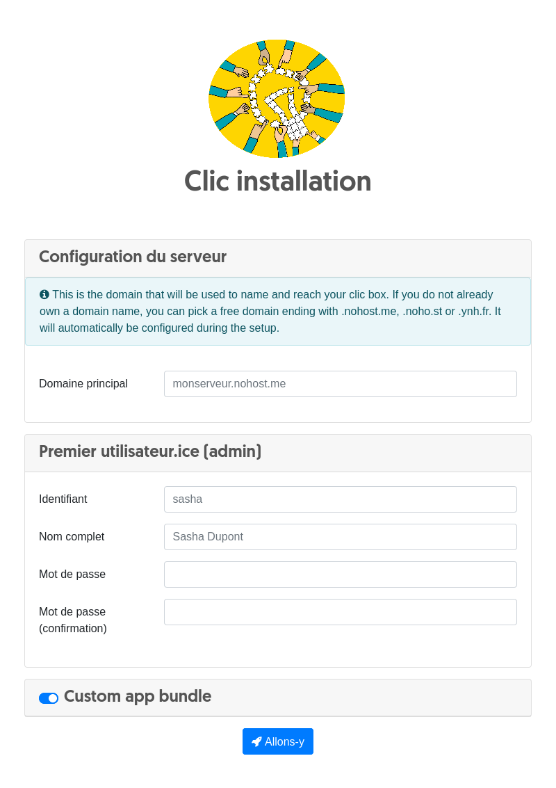
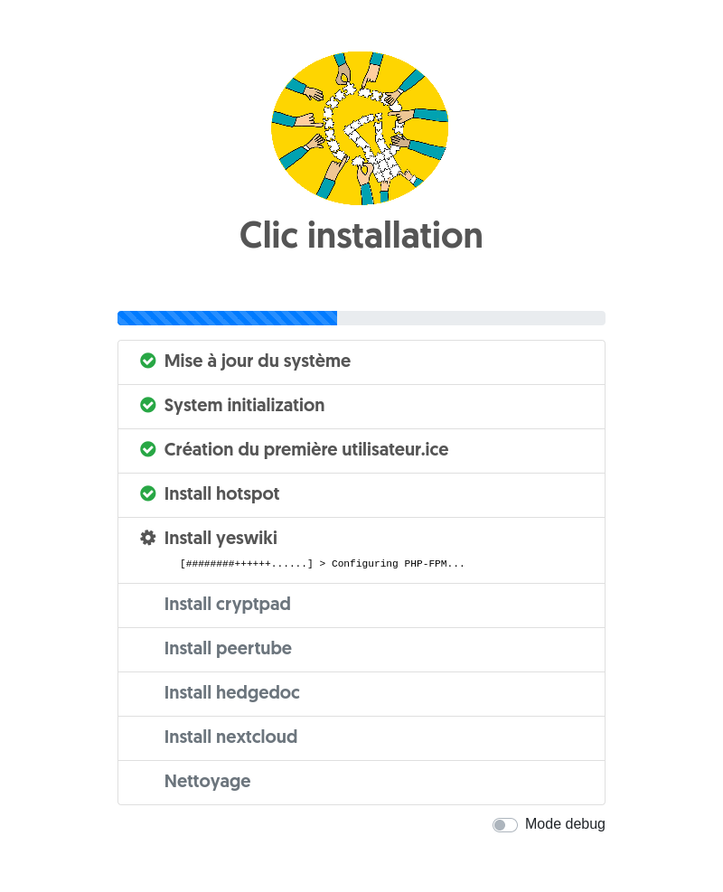

# Clic install procedure

This is the small web UI to install clic

It is injected in the yunohost/clic images [here](https://github.com/YunoHost/arm-images/blob/yunohost/userpatches/customize-image.sh)

### Screenshots





### Development

Set up a Yunohost LXC, then:

```
git clone https://github.com/alexAubin/clic /var/www/install_clic
cd /var/www/install_clic
source deploy/deploy.sh
```

### Translations

It's based on Flask-Babel: https://flask-babel.tkte.ch/

Setup a dev env using the instructions from previous section, then:

```
source venv/bin/activate
pybabel extract -F babel.cfg -o messages.pot .
pybabel update -i messages.pot -d translations
# ... translate stuff in translations/<lang>/LC_MESSAGES/messages.po
# then compile:
pybabel compile -d translations
```
